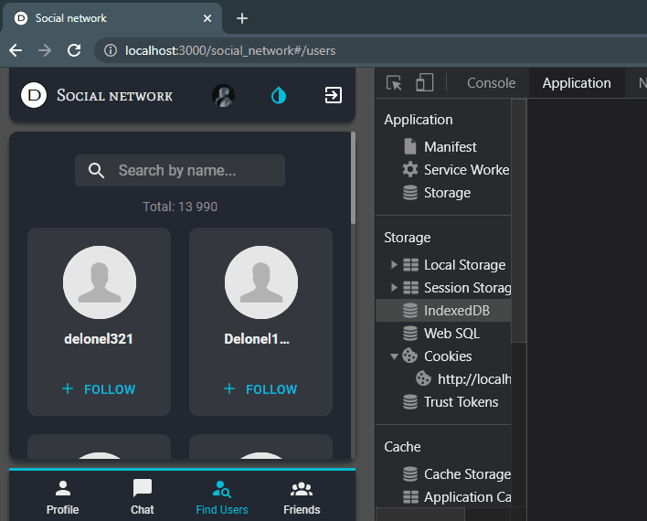
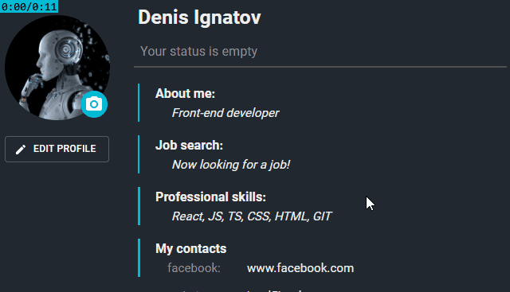
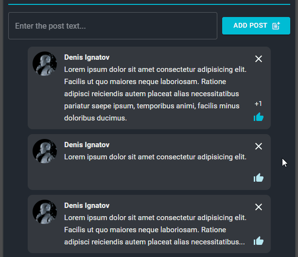
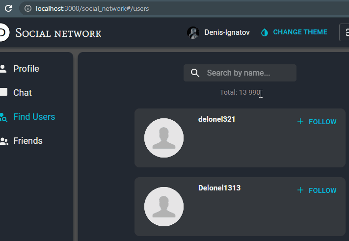

# Описание

&#9996; <a href="https://ignatov-ru.github.io/social_network/#/">Это</a> социальная сеть, SPA-приложение на React + Redux. Для входа в тестовый аккаунт нажмите ***Login to test account***.

Разработка стартовала с <a href="https://github.com/facebook/create-react-app">Create React App</a>. Все компоненты находятся в `./src`.

## Основные используемые технологии:

- React
    * Hooks (в том числе свои),
    * React.lazy,
    * Portal (в компоненте `ProfileInfoContainer`),
    * Render-prop (`ProfileDataForm`)
- React-redux
- React-router-dom
- Redux
- Redux-thunk
- Redux-form (компоненты `Login`, `ProfileDataForm`)
- Typescript
- WebSocket (`Chat`)
- SCSS и Material UI (для стилизации элементов форм)
- <a href="https://social-network.samuraijs.com/docs">Данный</a> серверный REST API с помощью axios

# Что реализовано
&#120823; &#127759; **Авторизация** (_redux-form_)
   - Валидация email на клиенте
   - Показ ошибок с сервера

&#120824; &#127912; **Смена темы**  по нажатию кнопки на нативном CSS
   - Сохранение темы в _Local Storage_
   

&#120825; &#9989; **Отзывчивая вёрстка** (от desktop) для всех экранов до 320px с возможностью навигации по приложению **с клавиатуры**
   

&#120826; &#9989; **Настроена маршрутизация** (_react-router-dom_)
   - Несуществующий URL перенаправляет на профиль
   - Redirect неавторизованных пользователей на страницу авторизации

&#120827; &#9989; **Показ preloader** при загрузках

&#120828; &#11088; **Страница "Профиль"** :
   - &#9998; Редактирование профиля (_redux-form_) и статуса, сохранение данных на сервере

   - &#128683; Вывод ошибки с сервера при указании некорректного URL в контактах профиля
   - &#128290; Счётчик введённых символов на формах профиля и статуса с подсветкой при наборе максимального кол-ва символов
   - &#10060; Закрытие статуса по клику вне его
   - 🔒 Блокировка кнопок сохранения до изменений в формах
   

&#32;&#32;

   - &#9998; Смена аватара и сохранение фото на сервере

   - &#10133; Добавление постов на стену, удаление постов по одному, выборочно несколько или все сразу (+ анимация), сохранение постов в _Local Storage_
   

&#120829; &#128172; **Страница "Чат"** :
   - Общий чат среди авторизованных пользователей на [social-network](https://social-network.samuraijs.com/) по протоколу _WebSocket_. _P.S.: в чате показываются 100 последних сообщений, очистка чата происходит раз в сутки_
   - Показ списка текущих участников чата
   - Сортировка участников по имени

&#120830; &#128587; **Страница "Поиск пользователей"** :
   - Подписка/ отписка на пользователей, отображение подписок на странице "Друзья", сохранение данных на сервере
   - Дозагрузка с сервера пользователей свыше 10 человек внизу страницы по нажатию кнопки &#11015;
   - Показ целиком имени и статуса пользователя длиной более 19 символов во всплывающем окне при наведении на них
   - &#128270; **Поле поиска**:
      - Поиск по имени среди всех пользователей, авторизованных на <a href="https://social-network.samuraijs.com/">social-network</a>
      - Синхронизация вводимого в поиск текста с query parameters URL и, наоборот, отображение по параметрам URL предвведённого поиска (_query-string_)
      

&#120831; &#129309; **Страница "Друзья"** :
   - Показ только друзей
   - Динамическая пагинация/ бесконечный список (_IntersectionObserver_) - автоматическая дозагрузка с сервера пользователей при скролле в конце страницы свыше 10 человек
   - &#128270; **Поле поиска**:
      - Поиск по имени среди друзей
      - debounce &#8987; при поиске 600 ms (_lodash_)

&#127937; Пока всё :&#41;
